# 🔐 Microservices Security – EazyBank 

This section is an **advancement of the Observability & Monitoring module**, where we introduce **security into EazyBank microservices** using **OAuth 2.0, OpenID Connect, Spring Security, and Keycloak**.

The goal is to ensure:
- Secure API access
- Token-based authentication
- Centralized identity management
- Role-based authorization at API Gateway level

---

## 🚧 Challenges Solved Using Microservices Security

By implementing **Spring Security + OAuth2 + OpenID Connect + Keycloak**, we solve:

- ❌ Unauthorized access to APIs  
- ❌ No centralized authentication system  
- ❌ Credential sharing between services  
- ❌ Lack of token-based security  
- ❌ No role-based access control  
- ❌ Difficult identity & access management  
- ❌ No standard security protocol  
- ❌ Poor scalability of custom auth logic  
- ❌ Security gaps at API Gateway  

---

## 🔑 What Is OAuth 2.0?

### 📘 Definition
**OAuth 2.0 (Open Authorization 2.0)** is an **industry-standard authorization framework** that allows a client application to access protected resources on behalf of a user or another service **without exposing credentials** such as usernames and passwords.

OAuth 2.0 focuses strictly on **authorization**, not authentication.

In a microservices and cloud-native architecture, OAuth 2.0 enables **secure, delegated access** by issuing **access tokens** that represent permissions granted by a resource owner.

It focuses on:
- *Who* can access
- *What* can be accessed
- *For how long*

---

## 🧠 OAuth 2.0 Terminology

### 1️⃣ Resource Owner  
The entity that owns the protected resource (user or service).

### 2️⃣ Client  
The application requesting access (e.g., API client).

### 3️⃣ Authorization Server  
Issues access tokens after authentication (**Keycloak**).

### 4️⃣ Resource Server  
Hosts protected APIs and validates tokens (**API Gateway**).

### 5️⃣ Scopes  
Permissions granted to the access token (e.g., `openid`, `profile`, `email`).

---

## 🆔 What Is OpenID Connect (OIDC)?


**OpenID Connect (OIDC)** is an **identity layer built on top of OAuth 2.0** that adds **authentication** capabilities.

While OAuth 2.0 answers:
> ❓ *What is this client allowed to access?*

OpenID Connect answers:
> ❓ *Who is the user?*

---

### 🧠 Why OpenID Connect Is Needed

OAuth 2.0 alone:
- Does NOT define user identity
- Only issues access tokens
- Cannot reliably authenticate users

OIDC extends OAuth 2.0 by:
- Introducing **ID Tokens**
- Standardizing user identity claims
- Enabling **Single Sign-On (SSO)**

---

### 🎯 What OpenID Connect Does

OpenID Connect:
- Authenticates users
- Provides verified user identity
- Issues **ID Tokens (JWTs)**
- Enables login, logout, and SSO
- Standardizes identity across systems


---

## 🔄 OAuth 2.0 + OpenID Connect Workflow

1. Client sends authentication request  
2. Authorization Server authenticates client  
3. Access Token (JWT) is issued  
4. Client sends request with Bearer token  
5. Resource Server validates token  
6. Access granted based on roles & scopes  

---

## 🛡️ What Is Keycloak?

**Keycloak** is an **open-source Identity and Access Management (IAM)** solution providing:

- OAuth 2.0 & OpenID Connect
- Authentication & Authorization
- JWT token management
- Role & client management

---

## ❓ Problems Solved by Keycloak

- Centralized authentication
- Token issuance & validation
- Role-based access control
- No custom security code
- Enterprise-grade IAM

---

## 🔐 Client Credentials Grant


**Client Credentials Grant** is an OAuth 2.0 authorization grant type used for **machine-to-machine (service-to-service) authentication**, where **no end user is involved**.

In this flow, a **client application authenticates itself** directly with the **Authorization Server** using its own credentials (**Client ID and Client Secret**) and receives an **access token**. This token is then used to securely access protected APIs.

This grant type is specifically designed for **backend systems, internal microservices, and trusted applications**.

---

## 🧠 Why Client Credentials Grant Is Needed

In microservices architecture:
- Services need to call **other services**
- There is **no user context**
- Credentials should **never be shared**
- Security must be **centralized**

Client Credentials Grant solves this by:
- Eliminating the need for user login
- Allowing secure service authentication
- Issuing short-lived access tokens
- Enforcing scope-based access

---

## 🎯 When to Use Client Credentials Grant

Use this grant type when:
- One backend service calls another backend service
- Scheduled jobs or batch processes access APIs
- API Gateways authenticate to downstream services
- Internal systems communicate securely

❌ **Do NOT use when a user is involved**

---

## 🔑 Key Characteristics

- No user interaction
- Token represents **the client**, not a user
- Highly secure for trusted systems
- Ideal for automation and internal APIs
- Uses OAuth 2.0 standard

---

## 🚀 Keycloak Setup (Auth Service)

### 🐳 Start Keycloak Using Docker

```bash
docker run -p 127.0.0.1:7080:8080 \
-e KC_BOOTSTRAP_ADMIN_USERNAME=admin \
-e KC_BOOTSTRAP_ADMIN_PASSWORD=admin \
quay.io/keycloak/keycloak:26.4.7 start-dev
```

- URL: http://localhost:7080  
- Username: `admin`  
- Password: `admin`  

---

## 🧩 Client Configuration in Keycloak

- **Client ID:** `eazybank-callcenter-cc`
- **Name:** Eazybank Callcenter App
- **Description:** Eazybank Callcenter App

### Settings:
- Enable **Client Authentication**
- Disable all flows
- Enable **Service Account Roles**
- Save client

### Credentials:
- Copy **Client Secret**

---

## 🔑 Generate Access Token (Client Credentials Flow)

- Copy `token_endpoint` from **OpenID Endpoint Configuration**

### Postman Request:
```text
POST {token_endpoint}

grant_type=client_credentials
client_id=eazybank_callcenter_cc
client_secret=xxxxxxxx
scope=openid email profile
```

✔️ Response contains Access Token (JWT)

---

## 🌐 Securing API Gateway (Resource Server)

### 📦 Dependencies

```xml
<dependency>
    <groupId>org.springframework.boot</groupId>
    <artifactId>spring-boot-starter-security</artifactId>
</dependency>

<dependency>
    <groupId>org.springframework.security</groupId>
    <artifactId>spring-security-oauth2-resource-server</artifactId>
</dependency>

<dependency>
    <groupId>org.springframework.security</groupId>
    <artifactId>spring-security-oauth2-jose</artifactId>
</dependency>
```

---

## 🔑 JWT Validation Configuration

```yaml
security:
  oauth2:
    resourceserver:
      jwt:
        jwk-set-uri: "http://localhost:7080/realms/master/protocol/openid-connect/certs"
```

---

## 🔒 Gateway Security Configuration

```java
@Configuration
@EnableWebFluxSecurity
public class SecurityConfig {

    @Bean
    public SecurityWebFilterChain springSecurityFilterChain(ServerHttpSecurity serverHttpSecurity) {

        serverHttpSecurity.authorizeExchange(exchanges -> exchanges
                .pathMatchers(HttpMethod.GET).permitAll()
                .pathMatchers("/eazybank/accounts/**").hasRole("ACCOUNTS")
                .pathMatchers("/eazybank/cards/**").hasRole("CARDS")
                .pathMatchers("/eazybank/loans/**").hasRole("LOANS"))
            .oauth2ResourceServer(oAuth2 -> oAuth2
                .jwt(jwt -> jwt.jwtAuthenticationConverter(grantedAuthoritiesExtractor())));

        serverHttpSecurity.csrf(csrf -> csrf.disable());
        return serverHttpSecurity.build();
    }

    private Converter<Jwt, Mono<AbstractAuthenticationToken>> grantedAuthoritiesExtractor() {
        JwtAuthenticationConverter converter = new JwtAuthenticationConverter();
        converter.setJwtGrantedAuthoritiesConverter(new KeycloakRoleConverter());
        return new ReactiveJwtAuthenticationConverterAdapter(converter);
    }
}
```

---
## 🔐 Role-Based Authorization in Gateway Server (Keycloak + JWT)

After securing the Gateway Server as an OAuth2 Resource Server, the next step was to **implement authorization using roles** provided by **Keycloak**.

In this setup:
- Each microservice route is protected by a **specific role**
- Roles are extracted from the **JWT access token**
- Authorization is enforced **centrally at the API Gateway**

---

## 🎯 Goal

| Route | Required Role |
|------|--------------|
| `/eazybank/accounts/**` | `ACCOUNTS` |
| `/eazybank/cards/**` | `CARDS` |
| `/eazybank/loans/**` | `LOANS` |

---

## 🧠 How It Works (High Level)

1. Client sends request with **JWT access token**
2. Gateway validates token using **Keycloak public keys**
3. Roles are present inside JWT under `realm_access.roles`
4. A **custom role converter** extracts roles from JWT
5. Spring Security maps roles → `ROLE_*`
6. Gateway authorizes requests based on route + role

---

## 🛡️ Security Configuration (Gateway Server)

This configuration:
- Enables **WebFlux Security**
- Secures routes using `hasRole()`
- Configures Gateway as an **OAuth2 Resource Server**
- Uses a **custom JWT role extractor**

```java
@Configuration
@EnableWebFluxSecurity
public class SecurityConfig {

    @Bean
    public SecurityWebFilterChain springSecurityFilterChain(ServerHttpSecurity serverHttpSecurity) {

        serverHttpSecurity.authorizeExchange(exchanges -> exchanges
                        .pathMatchers(HttpMethod.GET).permitAll()
                        .pathMatchers("/eazybank/accounts/**").hasRole("ACCOUNTS")
                        .pathMatchers("/eazybank/cards/**").hasRole("CARDS")
                        .pathMatchers("/eazybank/loans/**").hasRole("LOANS")
                )
                .oauth2ResourceServer(oAuth2ResourceServerSpec ->
                        oAuth2ResourceServerSpec.jwt(jwtSpec ->
                                jwtSpec.jwtAuthenticationConverter(grantedAuthoritiesExtractor())
                        )
                );

        serverHttpSecurity.csrf(csrfSpec -> csrfSpec.disable());
        return serverHttpSecurity.build();
    }

    private Converter<Jwt, Mono<AbstractAuthenticationToken>> grantedAuthoritiesExtractor() {
        JwtAuthenticationConverter jwtAuthenticationConverter =
                new JwtAuthenticationConverter();
        jwtAuthenticationConverter.setJwtGrantedAuthoritiesConverter(
                new KeycloakRoleConverter()
        );
        return new ReactiveJwtAuthenticationConverterAdapter(jwtAuthenticationConverter);
    }
}
```
---
## 🔐 Keycloak Security Implementation – Step by Step 

The following screenshots demonstrate the complete flow of implementing **OAuth2 Client Credentials Grant with Keycloak** and securing microservices via the **API Gateway**.

---

### 🖥️ Keycloak Admin Console Access
Keycloak sign-in page used to access the Admin Console.


---

### 🧩 Creating OAuth2 Client
Created a new OAuth2 client for service-to-service communication.

- Client ID: `eazybank-callcenter-cc`
- Client Authentication: Enabled

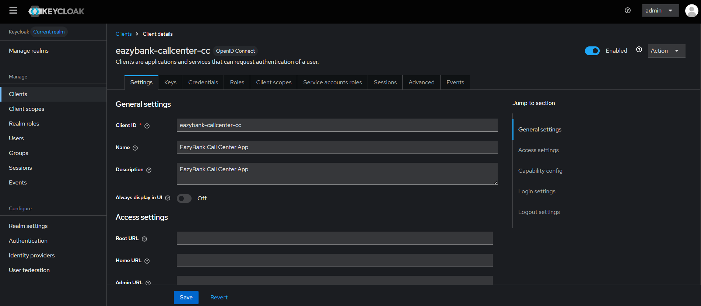

---

### 🎭 Assigning Roles in Keycloak
Roles (`ACCOUNTS`, `CARDS`, `LOANS`) assigned to the client for authorization.

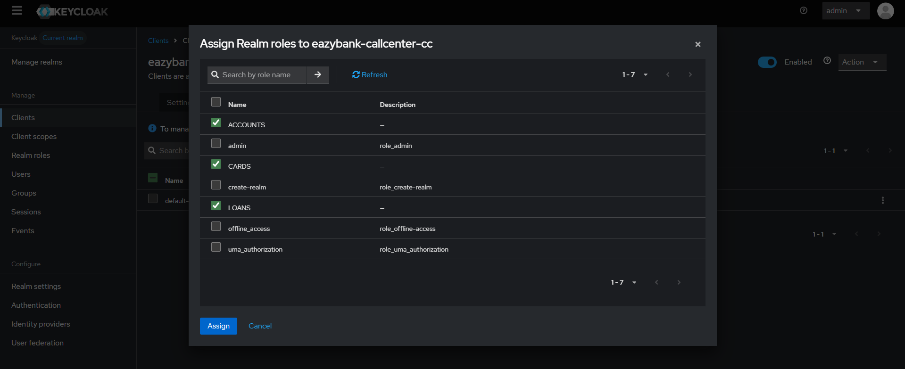

---

### 🔑 Client Credentials (ID & Secret)
Copied **Client ID** and **Client Secret** from the Credentials tab.

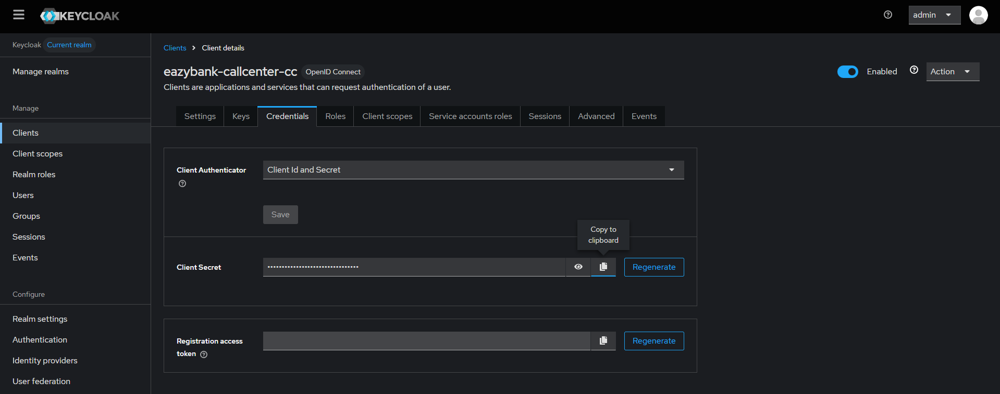

---

### 🚫 API Call Without Access Token
POST request to Accounts API without token → **Request rejected**.

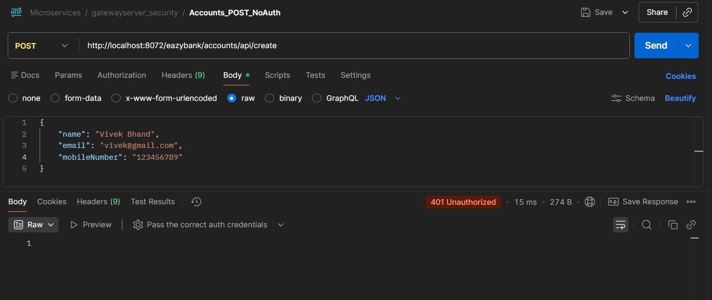

---

### 📬 Configuring Postman for Token Generation
Configured Postman to request access token using **Client Credentials Grant**.

- Grant Type: `client_credentials`
- Scope: `openid profile email`

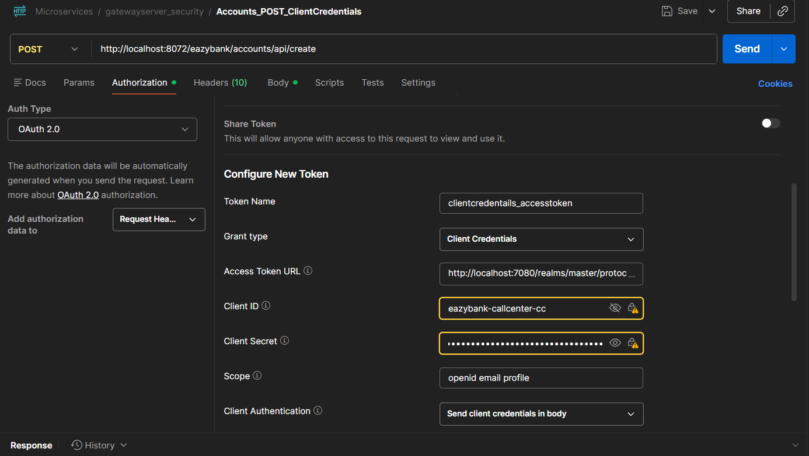

---

### ✅ Access Token Generated Successfully
Keycloak Authorization Server returned a valid **JWT access token**.

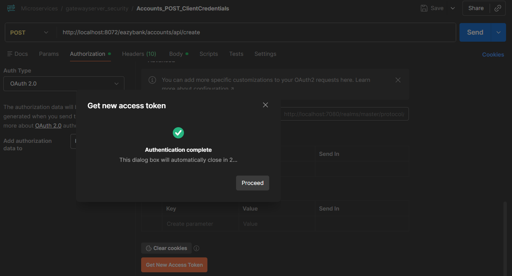

---

### 🔓 API Call With Access Token (Success) 
POST request to secured API with Bearer token → **Request successful**.

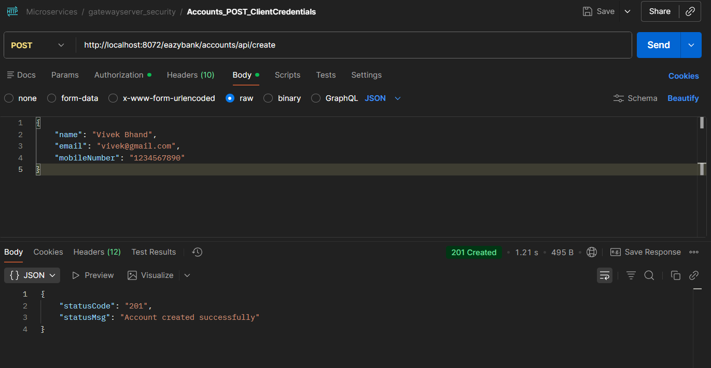

---
## 🔐 Authorization Code Grant – User-Based Authentication

After securing service-to-service communication using **Client Credentials Grant**, the next advancement is implementing **Authorization Code Grant**, which enables **user-based authentication and authorization**.

This flow is used when a **real end user interacts with the system**, such as UI applications (web or mobile).

---

## 🔄 How Authorization Code Grant Works (User ↔ Server Interaction)

The Authorization Code Grant involves **interaction between the User, Client Application, Authorization Server, and Resource Server**.

### 🔁 Step-by-Step Flow

1️⃣ **User accesses the Client Application**  
The user opens a UI application (e.g., Call Center UI).

2️⃣ **Client redirects user to Authorization Server (Keycloak)**  
The client redirects the user to Keycloak’s login page for authentication.

3️⃣ **User authenticates with credentials**  
The user enters username & password on the Keycloak login screen.

4️⃣ **Authorization Code is generated**  
After successful login, Keycloak generates a **short-lived authorization code**.

5️⃣ **Client exchanges code for Access Token**  
The client sends the authorization code + client credentials to Keycloak’s token endpoint.

6️⃣ **Keycloak issues tokens**  
Keycloak returns:
- Access Token (JWT)
- (Optional) Refresh Token
- (Optional) ID Token (OIDC)

7️⃣ **Client accesses protected APIs**  
The client sends the Access Token to the API Gateway.

8️⃣ **Gateway validates token & roles**  
Gateway validates JWT and allows access based on user roles.

✅ **Result:** Secure, user-authenticated access to microservices.

---

## 🆚 Client Credentials vs Authorization Code Grant

| Aspect | Client Credentials Grant | Authorization Code Grant |
|------|--------------------------|--------------------------|
| User Involvement | ❌ No user | ✅ User involved |
| Used For | Service-to-service | User-facing applications |
| Authentication | Client only | User + Client |
| Token Owner | Application | User |
| Typical Use Case | Internal APIs, backend jobs | Web apps, UI, dashboards |

---

## 🧩 Registering Client for Authorization Code Grant (Keycloak)

To implement Authorization Code Grant, a **new OAuth2 client** was registered in Keycloak.

### 🖥️ Client Details

- **Client ID:** `eazymarketing-callcenter-ac`
- **Name:** Eazybank Call Center UI App

### ⚙️ Client Configuration

- Client Authentication: ✅ Enabled
- Authorization Flow:
  - ✅ Standard Flow (Authorization Code)
- Redirect Settings:
  - Valid Redirect URIs: `*`
  - Web Origins: `*`

After configuration, the client was **saved successfully**.

---

## 👤 Creating End User in Keycloak

Authorization Code Grant **requires a user**, so an end user was created.

### 🧾 User Creation Steps

1️⃣ Navigate to **Users → Add User**  
2️⃣ Enter user details (username, email, etc.)  
3️⃣ Create user  
4️⃣ Set password  
5️⃣ Save changes  

The user is now ready to authenticate via Keycloak.


---
## 🔐 Authorization Code Grant – 

The following screenshots demonstrate the **complete end-to-end flow of OAuth2 Authorization Code Grant** using **Keycloak**, **Postman**, and a secured **API Gateway**.


### 🧩 Creating OAuth2 Client (Authorization Code Grant)
A new OAuth2 client was created in Keycloak specifically for **user-based authentication**.

- Client ID: `eazymarketing-callcenter-ac`
- Standard Flow: Enabled
- Client Authentication: Enabled

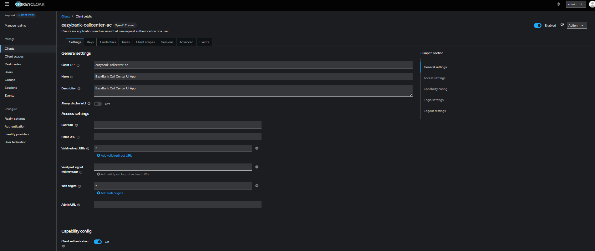

---

### 👤 Creating New User
A new end user was created in Keycloak to participate in the Authorization Code Grant flow.

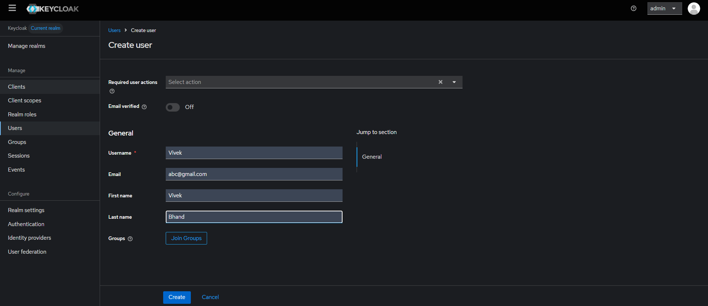

---

### 🎭 Assigning Realm Roles to User
Realm-level roles (`ACCOUNTS`, `CARDS`, `LOANS`) were assigned to the user for authorization.


---

### 🔑 Setting Password for User
A password was configured for the newly created user to allow login via Keycloak.

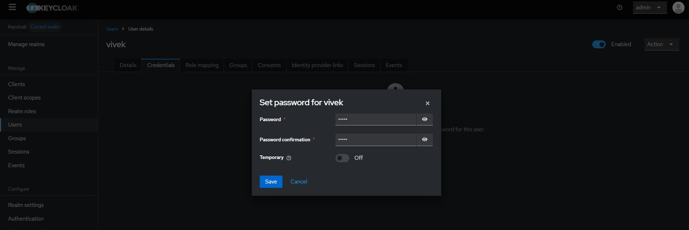

---

### 🔐 Copying Client Credentials
Client ID and Client Secret were copied from the **Credentials** tab of the client.


---

### 📬 Configuring Postman (Authorization Code Grant)
Postman was configured with:
- Grant Type: `authorization_code`
- Client ID & Secret
- Authorization URL
- Token URL
- Redirect URI

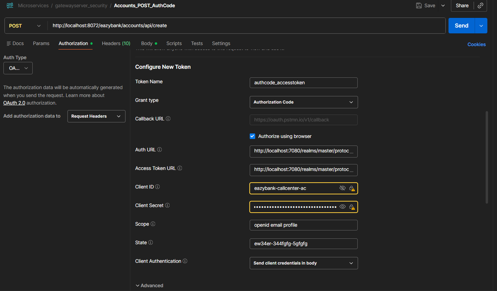

---

### 🔁 Redirect to Keycloak Login Page
While requesting the access token, Postman redirected to **Keycloak login page**, asking for user credentials.


---

### ✅ User Authentication Successful
User successfully authenticated with username and password in Keycloak.

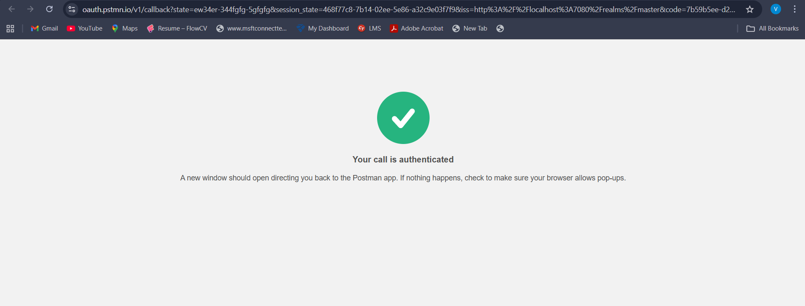

---

### 🪪 Access Token Generated
Keycloak returned a **JWT access token** after successful authentication and authorization.

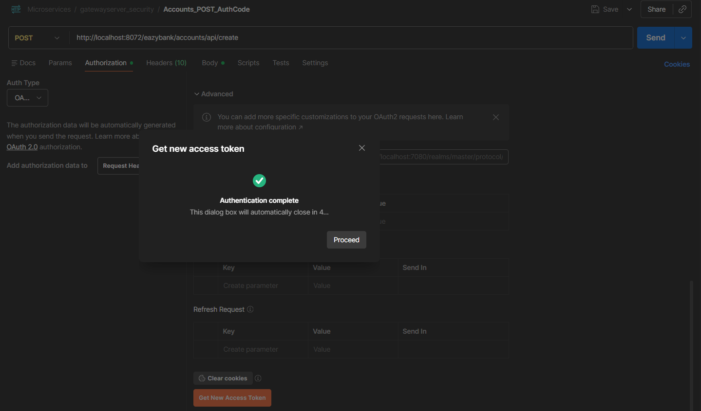

---

### 🔓 API Access with Authorization Code Grant
POST request to secured API succeeded using the access token.

- HTTP Status: **200 OK**
- Token validated by API Gateway
- Authorization enforced using roles

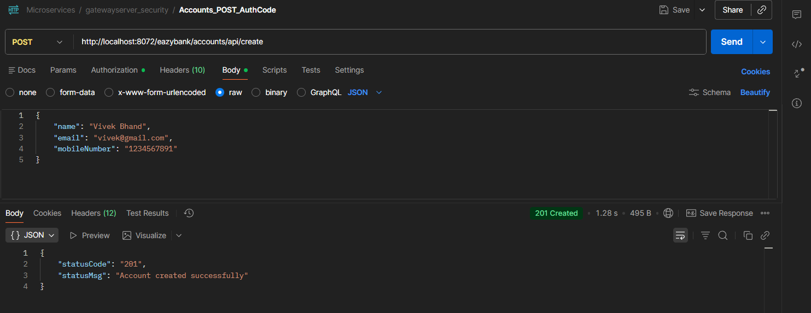

---

## ✅ Outcome

- OAuth2 Authorization Code Grant successfully implemented
- User authentication handled by Keycloak
- JWT access tokens generated and validated
- Role-based authorization enforced at API Gateway
- Secure user-to-microservices communication achieved

🚀 **This completes the Authorization Code Grant implementation in EazyBank**


